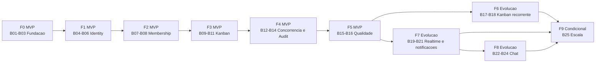

# Plano de Execucao

## Objetivo e convencoes

Este documento transforma as specs atuais em uma ordem executavel para uma pessoa trabalhando no monorepo. Ele preserva Angular + ASP.NET Core + EF Core + PostgreSQL, monorepo e execucao containerizada; nao introduz Java, Spring, Kafka, RabbitMQ ou microsservicos.

As estimativas sao relativas a uma pessoa: `P` = poucas horas, `M` = ate um dia focado. Um bloco pode ocupar uma ou mais sessoes; isso nao e uma data de calendario nem uma promessa de prazo. `G` nao e aceito como task implementavel: indica que a task ainda precisa ser quebrada.

Metodologia: DDD explicito para fronteiras, agregados e invariantes; BDD leve para cenarios criticos antes da implementacao; TDD seletivo para invariantes, autorizacao, concorrencia e refresh rotation. As demais tasks seguem Kanban simples, sem impor TDD integral.

## Regra de alinhamento do Kanban

O plano adota a regra operacional solicitada: um card pertence a exatamente um board e a movimentacao normal ocorre entre columns do mesmo board. A troca de board nao faz parte do MVP; somente podera ser adicionada como operacao futura explicita depois de uma regra de negocio aprovada, autorizacao e cenarios proprios.

Ha uma divergencia textual residual em `docs/specs/kanban.md`, que ainda descreve movimentacao entre boards do mesmo projeto. Ela nao e alterada nesta entrega por restricao do pedido. Antes de implementar T16, essa spec deve ser alinhada pela pessoa responsavel pelo produto; ate la, o plano e a fonte operacional deste recorte e a implementacao nao deve permitir troca de board silenciosa.

## Visao por fases

| Fase | Classificacao | EPIC | Resultado observavel |
|---|---|---|---|
| F0 | MVP | Fundacao e contratos | Stack containerizada, dominio, persistencia e contratos executaveis |
| F1 | MVP | Identity & Access | Cadastro, login, refresh rotation e logout seguros |
| F2 | MVP | Projects, Membership & Authorization | Projetos privados e isolamento resource-based |
| F3 | MVP | Kanban nuclear | Boards, columns, cards, arquivamento e movimento no mesmo board |
| F4 | MVP | Concorrencia e auditoria | `Version bigint`, `409 Conflict` e historico autorizado |
| F5 | MVP | Qualidade operacional | Suites, E2E, logs, metricas, backup e documentacao reproduzivel |
| F6 | Evolucao | Kanban recorrente | Ordenacao/busca/paginacao, convites e UX de uso recorrente |
| F7 | Evolucao | Realtime e notificacoes | SignalR autorizado e notificacoes in-app sem ampliar acesso |
| F8 | Evolucao | Chat | Conversas e mensagens autorizadas, persistidas e integradas ao realtime |
| F9 | Escala condicional | Capacidade medida | Cache, eventos ou replicas somente quando metricas justificarem |

## Grafo de fases e blocos

O caminho critico de entrega do MVP e `T01 -> T02 -> T04 -> T06 -> T07 -> T08 -> T12 -> T13 -> T14 -> T15 -> T16 -> T17 -> T18 -> T19 -> T20 -> T21 -> T22 -> T23`. T03, T05, T10, T11 e T24+ podem liberar paralelismo apenas quando suas dependencias reais estiverem prontas. Para uma pessoa, paralelismo significa alternar sessoes sem iniciar uma task bloqueada.

## EPIC -> FEATURE -> TASK

### F0 / EPIC: Fundacao e contratos

#### FEATURE F0.1: linguagem, fronteiras e ambiente

**B01 - Dominio e contratos de fundacao**

- **TASK T01** - Consolidar linguagem ubiqua, agregados, ownership e fronteiras DDD.
  - Spec: `docs/specs/foundation.md` e `docs/domain/domain-model.md`.
  - Dependencias: nenhuma.
  - Tamanho: P.
  - Pronto: checklist de ACs de fronteiras, invariantes e fatos de auditoria revisado; teste arquitetural/checklist confirma contratos permitidos e nenhum codigo de aplicacao e criado.
  - Testes: checklist de invariantes, revisao BDD e teste arquitetural de dependencias.

- **TASK T02** - Subir monorepo, Angular, API e PostgreSQL em Compose.
  - Spec: `docs/specs/containers.md`.
  - Dependencias: T01.
  - Tamanho: M.
  - Pronto: `docker compose config` e smoke test comprovam frontend, API, PostgreSQL, health checks e conexao API/DB sem segredo versionado.
  - Testes: Compose config, subida limpa, health check, reinicio com volume e busca de secrets.

**B02 - Persistencia controlada**

- **TASK T03** - Definir Problem Details, status HTTP, correlation id e configuracao externa.
  - Spec: `docs/specs/api-contracts.md`.
  - Dependencias: T01, T02.
  - Tamanho: P.
  - Pronto: testes de API demonstram `400/401/403/404/409/422/500`, correlation id estavel e startup explicito quando falta secret.
  - Testes: API, sanitizacao de logs, excecao global e configuracao.

- **TASK T04** - Configurar EF Core/PostgreSQL, migrations e ownership de persistencia.
  - Spec: `docs/specs/persistence.md`.
  - Dependencias: T01, T02.
  - Tamanho: M.
  - Pronto: banco vazio e upgrade conhecido aplicam migrations reproduziveis; UUID, UTC, constraints e `Version bigint` passam em PostgreSQL containerizado.
  - Testes: migration limpa/isolada, constraints, UTC/UUID, conexao real e estrategia forward-only ou rollback documentada.

**B03 - Gate da fundacao**

- Validar T01-T04 e registrar demonstracao local reproduzivel. Nao avancar sem Compose saudavel, migration executavel, contratos de erro testados e verificacao arquitetural das fronteiras.

### F1 / EPIC: Identity & Access

#### FEATURE F1.1: cadastro e sessao

**B04 - Cenarios e cadastro**

- **TASK T05** - Converter cadastro, login valido/invalido e nao enumeracao em cenarios BDD.
  - Spec: `docs/specs/identity.md`.
  - Dependencias: T01, T03.
  - Tamanho: P.
  - Pronto: cenarios executaveis falham pelas razoes esperadas e cobrem credencial protegida, tokens e resposta indistinguivel.
  - Testes: cenarios API/BDD inicialmente falhos.

- **TASK T06** - Implementar cadastro aberto, unicidade, hash de senha e auditoria.
  - Spec: `docs/specs/identity.md`.
  - Dependencias: T04, T05.
  - Tamanho: M.
  - Pronto: cadastro valido cria identidade e evento auditado; duplicidade e rejeitada e nenhum teste encontra senha em texto puro.
  - Testes: unidade de credencial, integracao de unicidade, API e varredura de logs/auditoria.

**B05 - Login e refresh**

- **TASK T07** - Implementar login e emissao de JWT curto mais refresh persistido somente como hash.
  - Spec: `docs/specs/identity.md`.
  - Dependencias: T06.
  - Tamanho: M.
  - Pronto: login valido emite claims minimas configuraveis; login invalido nao emite token nem enumera usuario.
  - Testes: API, claims/expiracao, banco/logs sem refresh ou secrets.

- **TASK T08** - Implementar refresh rotation, familia e deteccao atomica de reuse.
  - Spec: `docs/specs/identity.md`.
  - Dependencias: T07.
  - Tamanho: M.
  - Pronto: token valido e usado uma vez gera substituto; reuse revoga familia e nao emite novo token.
  - Testes: TDD seletivo para reuse, concorrencia de duas tentativas, expiracao e revogacao.

**B06 - Logout e gate de Identity**

- **TASK T09** - Implementar logout e revogacao idempotente auditada.
  - Spec: `docs/specs/identity.md`.
  - Dependencias: T08.
  - Tamanho: P.
  - Pronto: logout repetido nao reativa sessao e refresh posterior e rejeitado com resultado auditavel.
  - Testes: API, refresh apos logout e auditoria.

- Gate F1: jornada cadastro -> login -> refresh -> logout executa em ambiente containerizado; testes de credenciais, rotation, reuse, revogacao e ausencia de segredo passam.

### F2 / EPIC: Projects, Membership & Authorization

#### FEATURE F2.1: escopo privado e papeis

**B07 - Regra de autorizacao**

- **TASK T10** - Fechar matriz de permissoes, ownership e lacunas de `GlobalAdmin`.
  - Spec: `docs/specs/project-membership.md`.
  - Dependencias: T01, T06.
  - Tamanho: M.
  - Pronto: tabela de decisao aprovada cobre permitido, negado, membership ausente/inativo, Viewer e acesso cruzado sem inventar permissoes fora da spec.
  - Testes: tabela de decisao e cenarios de autorizacao.

- **TASK T11** - Registrar cenarios BDD de projeto privado, membership e isolamento.
  - Spec: `docs/specs/project-membership.md`.
  - Dependencias: T10.
  - Tamanho: P.
  - Pronto: cenarios falhos cobrem isolamento, revogacao, Viewer, administracao e anti-enumeracao.
  - Testes: BDD/API inicialmente falhos.

**B08 - Projeto e policies**

- **TASK T12** - Implementar projeto privado e membership ativo/inativo.
  - Spec: `docs/specs/project-membership.md`.
  - Dependencias: T04, T06, T10, T11.
  - Tamanho: M.
  - Pronto: projeto tem owner conforme regra aprovada; membership pode ser criado, alterado e revogado e cada mudanca e auditada.
  - Testes: invariantes, owner unico, integracao e API.

- **TASK T13** - Aplicar policies resource-based e isolamento por projeto.
  - Spec: `docs/specs/project-membership.md`.
  - Dependencias: T12, T03.
  - Tamanho: M.
  - Pronto: usuario sem escopo, revogado ou cruzado nao le nem altera projeto B, e Viewer nao executa mutacoes.
  - Testes: autorizacao API, anti-enumeracao e papel global sem acesso automatico.

- Gate F2: testes de isolamento entre dois projetos, revogacao e Viewer passam; nenhuma query de recurso protegido ignora membership ativo.

### F3 / EPIC: Kanban nuclear

#### FEATURE F3.1: boards, columns e cards

**B09 - Cenarios e invariantes Kanban**

- **TASK T14** - Validar cenarios BDD de board, column, card, arquivamento e movimento no mesmo board.
  - Spec: `docs/specs/kanban.md` + regra de alinhamento deste plano.
  - Dependencias: T13.
  - Tamanho: P.
  - Pronto: cenarios cobrem card em exatamente um board, column do mesmo board, projeto incorreto, arquivamento e Viewer; a divergencia board-to-board fica registrada para alinhamento antes de T16.
  - Testes: BDD inicialmente falho e teste de invariantes.

**B10 - Implementacao da fatia Kanban**

- **TASK T15** - Implementar boards, columns e cards autorizados, com arquivamento e pertencimento.
  - Spec: `docs/specs/kanban.md` e `docs/domain/domain-model.md`.
  - Dependencias: T04, T13, T14.
  - Tamanho: M.
  - Pronto: board pertence a um projeto, card pertence a exatamente um board, column pertence ao board e CRUD minimo respeita autorizacao.
  - Testes: unidade de invariantes, constraints, API autorizada/negada e filtro de arquivados.

- **TASK T16** - Implementar movimento entre columns do mesmo board; bloquear troca de board no MVP.
  - Spec: `docs/specs/kanban.md` + regra de alinhamento deste plano.
  - Dependencias: T15 e alinhamento da divergencia apontada em T14.
  - Tamanho: M.
  - Pronto: movimento valido preserva o board e ordem deterministica; tentativa de outro projeto ou board e rejeitada sem alterar o card. Operacao futura de troca de board fica apenas documentada, sem endpoint ativo.
  - Testes: TDD seletivo de pertencimento, API de movimento, estado imutavel apos rejeicao.

**B11 - Gate do nucleo Kanban**

- Gate F3: jornada projeto -> board -> column -> card -> mover -> arquivar passa ponta a ponta; card nunca fica sem ou com dois boards; nenhum movimento cruza board no MVP; Viewer nao muta.

### F4 / EPIC: Concorrencia e auditoria

#### FEATURE F4.1: edicao segura e historico

**B12 - Contrato de concorrencia**

- **TASK T17** - Preparar cenarios BDD e interleavings de primeira vitoria, conflito e recarga.
  - Spec: `docs/specs/optimistic-concurrency.md`.
  - Dependencias: T14, T15, T16.
  - Tamanho: P.
  - Pronto: testes falhos reproduzem dois clientes com a mesma versao e verificam ausencia de update parcial.
  - Testes: interleaving API/integracao.

- **TASK T18** - Aplicar `Version bigint` atomica aos comandos mutaveis.
  - Spec: `docs/specs/optimistic-concurrency.md`.
  - Dependencias: T04, T15, T16, T17.
  - Tamanho: M.
  - Pronto: primeira atualizacao vence, incrementa uma vez; conflito nao altera nem incrementa.
  - Testes: TDD/integracao PostgreSQL real com concorrencia.

**B13 - Recuperacao de conflito**

- **TASK T19** - Expor `409 Conflict` e recuperacao explicita no Angular.
  - Spec: `docs/specs/optimistic-concurrency.md` e `docs/specs/api-contracts.md`.
  - Dependencias: T18, T03.
  - Tamanho: M.
  - Pronto: payload de conflito permite recarregar; cliente nao repete comando mutavel cegamente e nova decisao usa versao atual.
  - Testes: API e E2E de recarga/conflito.

**B14 - Auditoria autorizada**

- **TASK T20** - Registrar auditoria append-only, minimizada e transacional para eventos relevantes.
  - Spec: `docs/specs/audit.md`.
  - Dependencias: T03, T06, T09, T12, T15, T18.
  - Tamanho: M.
  - Pronto: alteracao e conflito possuem ator, acao, recurso, projeto, UTC, resultado e correlation id quando disponivel; nenhum segredo aparece.
  - Testes: unidade de minimizacao, atomicidade, append-only e conflito sem falso sucesso.

- **TASK T21** - Implementar consulta autorizada de auditoria.
  - Spec: `docs/specs/audit.md`.
  - Dependencias: T13, T20.
  - Tamanho: P.
  - Pronto: usuario autorizado consulta apenas seu escopo em ordem deterministica; usuario sem permissao recebe rejeicao segura.
  - Testes: API de escopo permitido/negado.

- Gate F4: dois clientes reproduzem `200` + `409`, recarga e auditoria; consulta nao autorizada nao revela eventos e nenhuma operacao critica confirma sem politica transacional validada.

### F5 / EPIC: Qualidade operacional do MVP

#### FEATURE F5.1: verificacao reproduzivel

**B15 - Suites**

- **TASK T22** - Automatizar unit, integration, API e E2E do monorepo.
  - Spec: `docs/04-testing-strategy.md`.
  - Dependencias: T02, T04, T06, T15.
  - Tamanho: M.
  - Pronto: comandos documentados executam suites isoladas e juntas; falha retorna codigo diferente de zero e integracao usa PostgreSQL containerizado.
  - Testes: cada suite e execucao agregada.

**B16 - Operacao local e gate MVP**

- **TASK T23** - Adicionar logs estruturados, metricas basicas, backup/restore e docs operacionais.
  - Spec: `docs/04-testing-strategy.md`, `docs/specs/containers.md`, `docs/specs/audit.md`.
  - Dependencias: T20, T22.
  - Tamanho: M.
  - Pronto: health, correlation id, falhas e conflitos sao observaveis; backup restaura localmente e logs nao contem credenciais.
  - Testes: health, backup/restore e busca automatizada por secrets.

- Gate F5/MVP: todas as suites passam em ambiente limpo; demonstracao completa e reproduzivel; nenhum gate de F0-F4 e ignorado. F6 so inicia apos esse gate.

### F6 / EPIC: Evolucao Kanban

#### FEATURE F6.1: uso recorrente sem acoplamento

**B17 - Ordenacao, consulta e escala de tela**

- **TASK T26** - Fortalecer ordenacao deterministica e filtros de cards arquivados.
  - Spec: `docs/specs/kanban.md`.
  - Dependencias: T16, T18, T22.
  - Tamanho: M.
  - Pronto: leituras repetidas retornam a mesma ordem e filtros distinguem ativos/arquivados sem violar versao ou escopo.
  - Testes: unidade de ordenacao e integracao de consulta.

- **TASK T27** - Adicionar busca e paginacao simples dentro do escopo autorizado.
  - Spec: `docs/specs/project-membership.md`, `docs/specs/kanban.md`.
  - Dependencias: T13, T21, T22.
  - Tamanho: M.
  - Pronto: pagina e busca nao retornam outro projeto, mantem ordem deterministica e possuem contrato/API testado.
  - Testes: API, autorizacao e limites de pagina.

**B18 - Convites e UX recorrente**

- **TASK T28** - Implementar fluxo de convite/inclusao de membro conforme regra aprovada.
  - Spec: `docs/specs/project-membership.md`.
  - Dependencias: T10, T12, T13, T22.
  - Tamanho: M.
  - Pronto: administrador autorizado inclui membro, mudanca e auditada e o novo escopo vale na proxima decisao; sem acesso nao e possivel confirmar existencia.
  - Testes: API de convite/aceite ou inclusao definida, autorizacao, revogacao e auditoria.

- Gate F6: busca/paginacao/ordenacao e convite passam testes de escopo e regressao do MVP; nenhuma troca de board e adicionada sem regra explicita.

### F7 / EPIC: Realtime e notificacoes

#### FEATURE F7.1: SignalR autorizado

**B19 - Transporte realtime**

- **TASK T24** - Implementar SignalR com grupos autorizados e eventos pos-confirmacao.
  - Spec: `docs/specs/realtime.md`.
  - Dependencias: T13, T18, T20, T23.
  - Tamanho: M.
  - Pronto: alteracao confirmada publica id/versao apenas a membros autorizados; conflito nao publica falso sucesso.
  - Testes: grupos, reconexao apos revogacao, evento atrasado e isolamento.

#### FEATURE F7.2: contrato e entrega de notificacoes

**B20 - Domínio de notificacao**

- **TASK T29** - Modelar contrato de notificacao, destinatario, escopo e idempotencia.
  - Spec: `docs/specs/notifications.md` e `docs/domain/domain-model.md`.
  - Dependencias: T01, T20, T24.
  - Tamanho: P.
  - Pronto: contrato define evento confirmado, destinatario autorizado, ausencia de segredo e duplicidade sem efeito no dominio.
  - Testes: unidade de escopo, minimizacao e idempotencia.

- **TASK T30** - Implementar notificacao in-app apos evento confirmado, com falha observavel.
  - Spec: `docs/specs/notifications.md`.
  - Dependencias: T29, T24, T13, T23.
  - Tamanho: M.
  - Pronto: alteracao de card disponibiliza notificacao ao destinatario autorizado; falha nao desfaz card e pode ser observada/reprocessada.
  - Testes: integracao de entrega, falha/reprocessamento, acesso revogado e duplicidade.

**B21 - Gate realtime/notificacoes**

- Gate F7: conexao, reconexao, revogacao, evento atrasado, notificacao in-app e falha de entrega passam sem ampliar autorizacao nem alterar a confirmacao do dominio.

### F8 / EPIC: Chat

#### FEATURE F8.1: conversas privadas

T25 e a task historica do backlog para a capacidade de chat. Para manter a task pequena e executavel, sua entrega e decomposta nas tasks T31, T32 e T33 abaixo; T25 fica concluida somente quando o gate F8 passar.

**B22 - Modelo e cenarios de chat**

- **TASK T31** - Modelar Conversation/Message e cenarios BDD de isolamento, limites e ordenacao.
  - Spec: `docs/specs/chat.md` e `docs/domain/domain-model.md`.
  - Dependencias: T01, T13, T20, T24, T29.
  - Tamanho: P.
  - Pronto: agregados, ownership, paginacao, retenção pendente e cenarios de membro, sem acesso e projeto divergente estao definidos.
  - Testes: BDD e invariantes inicialmente falhos.

**B23 - Persistencia e API de conversa**

- **TASK T32** - Implementar conversas e mensagens persistidas com autorizacao e paginação.
  - Spec: `docs/specs/chat.md`.
  - Dependencias: T31, T04, T13, T22.
  - Tamanho: M.
  - Pronto: membro ativo envia mensagem nao vazia; leitura sem acesso e associacao entre projetos sao rejeitadas sem estado parcial.
  - Testes: unidade de ordenacao, API, integracao de projeto/board e paginacao.

**B24 - Eventos de chat e gate**

- **TASK T33** - Publicar novas mensagens no realtime para participantes autorizados e auditar eventos administrativos.
  - Spec: `docs/specs/chat.md`, `docs/specs/realtime.md`, `docs/specs/audit.md`.
  - Dependencias: T24, T30, T32.
  - Tamanho: M.
  - Pronto: mensagem persistida precede evento; somente participantes autorizados recebem; chat nao altera card.
  - Testes: integracao de evento, revogacao, auditoria e ausencia de mutacao Kanban.

- Gate F8: fluxo criar conversa -> enviar -> ler/paginar -> receber evento passa; politicas de retenção ainda abertas ficam explicitamente bloqueadas para funcionalidades que dependam delas.

### F9 / EPIC: Escala condicional

#### FEATURE F9.1: remover gargalo comprovado

**B25 - Decisao de capacidade**

- **TASK T34** - Medir gargalo e registrar ADR de cache, evento interno/externo ou replica, se necessario.
  - Spec: ADR-002, `docs/specs/notifications.md` e `docs/04-testing-strategy.md`.
  - Dependencias: gate F5; T24/T30/T33 quando a mudanca tocar realtime, notificacoes ou chat.
  - Tamanho: M.
  - Pronto: metricas reproduziveis demonstram o gargalo, alternativa escolhida tem impacto de consistencia/autorizacao documentado e nao introduz broker/microsservico sem justificativa.
  - Testes: benchmark antes/depois, regressao de autorizacao, concorrencia e falha do componente opcional.

- Gate F9: nao existe implementacao de escala sem evidencia; a ADR, metricas e testes de regressao sao aprovados. Se nao houver gargalo, a saida e manter a topologia atual.

## Tabela de execucao

| Ordem | Bloco | EPIC | FEATURE | TASKS | Dependencias | Paralelo com | Saida |
|---:|---|---|---|---|---|---|---|
| 1 | B01 | F0 Fundacao | Linguagem e ambiente | T01-T02 | T01 -> T02 | Nenhum antes de T01 | DDD revisado e Compose inicial |
| 2 | B02 | F0 Fundacao | Contratos e persistencia | T03-T04 | T01/T02 | T03 e T04 entre si apos T02 | API contract e migrations |
| 3 | B03 | F0 Fundacao | Gate | validar F0 | T01-T04 | Nenhum | Stack reproduzivel |
| 4 | B04 | F1 Identity | Cadastro | T05-T06 | T03/T04 | T05 pode fechar enquanto T04 termina | Cadastro auditado |
| 5 | B05 | F1 Identity | Login e refresh | T07-T08 | T06 -> T07 -> T08 | Nenhum no caminho | Sessao rotativa segura |
| 6 | B06 | F1 Identity | Logout/gate | T09 | T08 | T10 pode iniciar apos T06 | Identity validada |
| 7 | B07 | F2 Membership | Matriz e cenarios | T10-T11 | T01/T06 -> T10 -> T11 | T07 apos T06 | Autorizacao especificada |
| 8 | B08 | F2 Membership | Projeto e policies | T12-T13 | T04/T10/T11 -> T12 -> T13 | T14 so apos T13 | Isolamento privado |
| 9 | B09 | F3 Kanban | Cenarios | T14 | T13 | Preparacao T17 apos T14 | Contrato Kanban |
| 10 | B10 | F3 Kanban | Boards/cards | T15-T16 | T14 -> T15 -> T16 | T17 apos T16 | Fluxo no mesmo board |
| 11 | B11 | F3 Kanban | Gate | validar F3 | T15/T16 | Nenhum | Kanban MVP utilizavel |
| 12 | B12 | F4 Concorrencia | Interleaving e Version | T17-T18 | T16 -> T17 -> T18 | T20 somente apos produtores | Concorrencia atomica |
| 13 | B13 | F4 Concorrencia | Recuperacao | T19 | T18/T03 | T20 pode iniciar apos T18 | `409` e recarga |
| 14 | B14 | F4 Audit | Escrita e consulta | T20-T21 | T18/T13 | T19 e T20 podem alternar | Historico autorizado |
| 15 | B15 | F5 Qualidade | Suites | T22 | T02/T04/T06/T15 | T26 depois do MVP | Comandos de teste |
| 16 | B16 | F5 Qualidade | Operacao/gate | T23 | T20/T22 | Nenhum | MVP reproduzivel |
| 17 | B17 | F6 Kanban | Ordenacao e busca | T26-T27 | F5/T16/T21 | T28 apos T13 | Consulta recorrente |
| 18 | B18 | F6 Kanban | Convites/UX | T28 | T10/T12/T13/T22 | T26-T27 | Membership evoluido |
| 19 | B19 | F7 Realtime | SignalR | T24 | F5/T13/T18/T20 | T26-T28 | Eventos autorizados |
| 20 | B20 | F7 Notifications | Contrato | T29 | T20/T24 | T26-T28 | Contrato in-app |
| 21 | B21 | F7 Notifications | Entrega/gate | T30 | T29/T24/T23 | T31 apos T24 | Entrega sem ampliar escopo |
| 22 | B22 | F8 Chat | Modelo/cenarios | T25 (decomposta em T31) | T24/T29/T13 | T26-T30 se sem conflito de schema | Chat especificado |
| 23 | B23 | F8 Chat | API/persistencia | T32 | T31/T04/T13 | Nenhum | Mensagens persistidas |
| 24 | B24 | F8 Chat | Realtime/gate | T33 | T32/T24/T30 | Nenhum | Chat autorizado |
| 25 | B25 | F9 Escala | Evidencia/ADR | T34 | gates e componentes afetados | Nenhuma | Escala justificada ou adiada |

## Primeiras 10 sessoes

1. Ler e validar `foundation.md`, `domain-model.md` e ADR-002; fechar T01 e o registro da regra card/board/column.
2. Implementar T02: Compose, Dockerfiles, variaveis externas e health checks.
3. Implementar T03: Problem Details, correlation id e startup seguro.
4. Implementar T04: EF Core, PostgreSQL, primeira migration e teste de banco vazio.
5. Executar o gate F0 e congelar a demonstracao local reproduzivel.
6. Escrever T05 e implementar T06: cenarios de identidade, cadastro, hash e auditoria.
7. Implementar T07: login, claims minimas, access JWT curto e refresh hash.
8. Implementar T08 com TDD seletivo: rotation, reuse e concorrencia de refresh.
9. Implementar T09 e executar o gate F1 completo.
10. Fechar T10-T11: matriz de permissoes, cenarios BDD de isolamento e contrato para iniciar T12.

## Gates globais

Nenhuma fase avanca sem validacao executavel do gate anterior. Cada gate deve deixar comando, resultado e ambiente registrados no documento de progresso ou na evidencia de CI futura. Falha em teste de autorizacao, concorrencia, segredo, pertencimento, migration ou isolamento bloqueia a fase seguinte; nao ha excecao por a funcionalidade parecer funcionar manualmente.

## Rastreabilidade de specs

- Fundacao e dominio: `docs/specs/foundation.md`, `docs/domain/domain-model.md`.
- Infraestrutura e dados: `docs/specs/containers.md`, `docs/specs/persistence.md`.
- Contratos e identidade: `docs/specs/api-contracts.md`, `docs/specs/identity.md`.
- Projeto e Kanban: `docs/specs/project-membership.md`, `docs/specs/kanban.md`.
- Concorrencia e historico: `docs/specs/optimistic-concurrency.md`, `docs/specs/audit.md`.
- Qualidade: `docs/04-testing-strategy.md`.
- Evolucao: `docs/specs/realtime.md`, `docs/specs/notifications.md`, `docs/specs/chat.md`.
